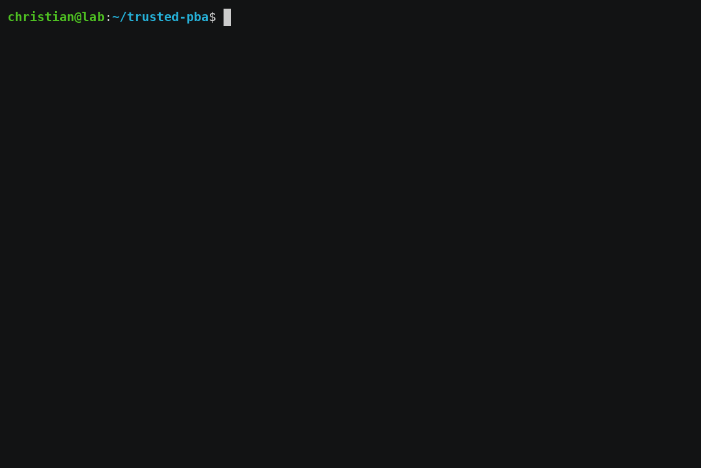
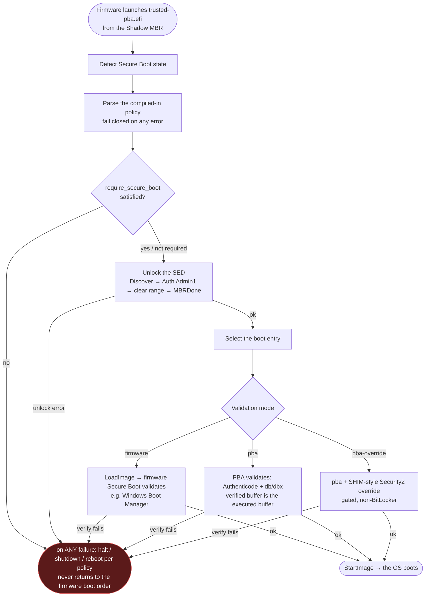

<div align="center">

# 🔒 trusted-pba

**A tiny, Secure-Boot-friendly pre-boot authenticator that unlocks your TCG Opal
self-encrypting drive — then hands off to Windows or Linux without ever leaving UEFI.**

Written in Go on [TamaGo](https://github.com/usbarmory/tamago). No operating system, no
`ExitBootServices`, no `kexec` — so the measured-boot chain (and BitLocker) stays intact.

<!-- update owner/repo in the CI badge if the repository is moved -->
[](https://github.com/9elements/trusted-pba/actions/workflows/ci.yml)
[](LICENSE)
[](go.mod)
[](https://github.com/usbarmory/tamago)
[](#security)

</div>



> The clip above is a real CI run: the PBA boots from a virtual drive's Shadow MBR,
> authenticates and unlocks a mock Opal SED, disables the Shadow MBR, and chainloads a
> **real Linux kernel** all the way to userspace — no hardware.

## Why trusted-pba?

Full-disk encryption on modern drives is done by the **drive itself** (TCG Opal
self-encryption) — no CPU crypto tax. The catch is *unlocking* it before the OS boots.
The common answer boots a whole Linux kernel as the pre-boot authenticator (PBA), unlocks,
then reboots/`kexec`s into the real OS — which **tears down and rebuilds the boot chain**,
breaking measured boot and BitLocker's PCR seal.

`trusted-pba` is a **single signed UEFI application** that stays resident in UEFI boot
services the entire time. It unlocks the SED and **chainloads the next stage in place**, so
the firmware→Windows handoff is byte-for-byte what Windows expects.

|  | **trusted-pba** | Linux-kernel PBA (e.g. sedutil `linuxpba`) | Firmware/BIOS password | BitLocker (software FVE) |
|---|:---:|:---:|:---:|:---:|
| Hardware SED encryption (no CPU overhead) | ✅ Opal | ✅ Opal | — | ⚠️ only with eDrive |
| Stays in UEFI — clean Windows/BitLocker handoff | ✅ never `ExitBootServices` | ❌ boots Linux, then reboot/`kexec` | ✅ | ✅ |
| Trust-brokers the next stage (Authenticode + `db`/`dbx`) | ✅ | ❌ | ❌ | n/a |
| Attack surface | tiny (one Go EFI app, no OS) | large (a full Linux) | firmware | OS + firmware |
| Secure Boot: signed, first-class EFI app | ✅ | ⚠️ needs shim + large signed TCB | ✅ | ✅ |
| Open source & auditable | ✅ MIT | ✅ | ❌ | ❌ |

> **Security-critical pre-boot software.** It **fails closed** on every authentication,
> unlock, verification, or policy error and never boots an untrusted or revoked image.
> Development follows a documented secure-development lifecycle (CRA / ISO 27001 / SSDF /
> SLSA readiness).

## Contents

[Status](#status) · [Try it in 60 seconds](#try-it-in-60-seconds) · [How it works](#how-it-works) ·
[Features](#features) · [Configuration](#configuration) · [Testing](#testing) ·
[Security](#security) · [Project structure](#project-structure) ·
[Documentation](#documentation) · [Contributing](#contributing) · [License](#license)

## Status

The core PBA is **feature-complete and validated in QEMU/OVMF CI**; hardware bring-up is
**in progress**.

| Capability | State |
|---|---|
| Opal SED unlock (discovery → auth → unlock → `MBRDone`) | ✅ Working — proven against real hardware and the Linux `sed-opal` wire format |
| UEFI Storage Security + NVMe-passthru transports | ✅ Working |
| Secure Boot detection & `require_secure_boot` enforcement | ✅ Working |
| Compiled-in fail-closed boot policy | ✅ Working |
| Image validation — `firmware` / `pba` / `pba-override` modes | ✅ Working |
| Chainload to Windows / Linux / custom EFI (in QEMU) | ✅ Working — incl. a **real Linux kernel** to userspace |
| Real on-hardware chainload, recovery, per-drive matrix | 🚧 In progress |
| Real user/device authentication (vs. compiled-in test PIN) | 🚧 In progress (pluggable credential sources: console, keyfile, sedutil-pbkdf2) |
| Signed, provenanced release artifact | 📋 Planned |

See the [issues](../../issues) and [milestones](../../milestones) for current work.

## Try it in 60 seconds

No hardware needed — everything runs in QEMU/OVMF. You need `qemu-system-x86_64`, OVMF,
`mtools`, and `python3`; [go-task](https://taskfile.dev) drives the build and the pinned
TamaGo toolchain installs itself.

```bash
git clone https://github.com/9elements/trusted-pba && cd trusted-pba
task setup      # install the pinned TamaGo toolchain + resolve deps (one-time)
task run        # build bin/trusted-pba.efi and boot it in QEMU/OVMF
```

`task run` boots the PBA and chainloads a test fixture, asserting the boot markers. You'll
see the fail-closed boot flow on the serial console:

```text
TRUSTED-PBA: start
TRUSTED-PBA: secure-boot: off
TRUSTED-PBA: sed unlock not required by policy
TRUSTED-PBA: target "test-fixture" (EFI/TEST/TESTAPP.EFI) via firmware
TRUSTED-PBA: starting EFI/TEST/TESTAPP.EFI
TEST-APP: ok
TRUSTED-PBA: chainload returned
```

### Watchable demos

Want the full show — **the PBA unlocking a (virtual) Opal SED and handing off to a real OS**,
in a graphical QEMU window? The `demo:*` tasks download a small Alpine image on first run
(cached in `.demo-cache/`) and boot the whole flow. Add `SERIAL=1` for a headless serial run.

```bash
task demo:linux        # mock SED unlock → chainload → REAL Alpine Linux to a login prompt
task demo:secureboot   # Secure Boot ENFORCING: firmware validates the signed PBA → the PBA
                       # trust-brokers a second-key-signed OS (pba validation) → Alpine boots
task demo:sed          # interactive: type the SED passphrase yourself to unlock (console source)
```

`demo:secureboot` is the trust-broker story end to end: OVMF boots with Secure Boot enforcing
and our keys enrolled, the firmware validates the PBA, and then the **PBA** verifies the OS's
Authenticode against a CA embedded in its own trust store before loading it — tamper the OS and
it fails closed (`signer does not chain to a trusted db certificate`), never booting.

The same paths are asserted headlessly in CI:

```bash
task test:opal-mock       # unlock a mock Opal SED → MBRDone → chainload (+ fail-closed negatives)
task test:linux           # unlock, then chainload a REAL Linux kernel to userspace
task check                # local CI: lint + unit/fuzz tests + the QEMU matrices
```

## How it works

The PBA runs as a UEFI application launched from the drive's Shadow MBR:



Two architectural rules keep it auditable: **the Opal protocol layer depends only on an
abstract transport interface** (never on UEFI), and the PBA is a **single-hop trust
broker** — it validates only the one image it hands control to, then that image brokers its
own downstream trust (shim/MOK for Linux, firmware `db` for Windows).

## Features

<details open>
<summary><b>Working today</b></summary>

- **UEFI-native, boot-services-resident** PBA on TamaGo — stays in UEFI through the handoff;
  never calls `ExitBootServices` (ADR-0001/0002).
- **TCG Opal SED unlock** — Level-0 Discovery → authenticated Locking-SP session (Admin1,
  PIN as host challenge) → clear the global locking range → set `MBRDone` → end session.
  Byte-faithful TCG wire format.
- **Two transports** — `EFI_STORAGE_SECURITY_COMMAND_PROTOCOL` and a raw **NVMe-passthru**
  carrier (`EFI_NVM_EXPRESS_PASS_THRU`) for firmware whose Storage Security mediation is
  unreliable. Opal protocol logic is cleanly separated from transport (ADR-0004).
- **Secure Boot aware & enforcing** — detects `SecureBoot`/`SetupMode` and, when the policy
  sets `require_secure_boot`, **fails closed** unless firmware is enforcing (ADR-0003).
- **Compiled-in, fail-closed boot policy** (embedded JSON) — see [Configuration](#configuration).
- **Three second-stage validation modes** — `firmware` (let firmware Secure Boot validate,
  the Windows path), `pba` (validate it ourselves: Authenticode + PKCS#7 chain to an
  embedded Microsoft trust store + `dbx` revocation; the verified buffer *is* the executed
  buffer), and `pba-override` (`pba` plus a SHIM-style Security2 override for out-of-`db`
  images; `-tags trustbroker`, scoped away from BitLocker — ADR-0012/0013).
- **Pluggable unlock credential** (ADR-0011) — `policy-pin` (compiled-in debug), interactive
  `console` prompt, or `keyfile`; with an optional `sedutil-pbkdf2` derive so it unlocks
  drives provisioned by stock sedutil.
- **Fail-closed by construction** — any error terminates via the policy `on_error` action;
  control never returns to the firmware boot order. PINs are zeroized once and never logged.
- **Fully virtual test path** — unit + fuzz tests, an EDK2 `MockOpalDxe` driver, and QEMU
  matrices (incl. a real-kernel boot) on every PR in CI, no hardware.

</details>

<details>
<summary><b>Planned / in progress</b></summary>

- **Real hardware bring-up** — on-hardware chainload to Windows/Linux, PSID reset/recovery,
  and a per-drive compatibility matrix.
- **Robust drive targeting ([#81](../../issues/81))** — select a drive by NVMe serial / WWN
  instead of the interim "locked SED with a Shadow MBR" heuristic.
- **Multi-entry boot selection / availability fallback** — today the policy uses the first entry.
- **QEMU virtual SED device model** (deferred) — faithful Shadow-MBR block visibility.
- **Reproducible release build + SBOM/provenance/signing** — `release.yml` scaffolding exists;
  the signed, provenanced artifact is still TODO.

</details>

## Configuration

The PBA takes **no runtime configuration** — no config file, no flags, no environment
variables. Everything is fixed at **build time** in two layers: a **compiled-in JSON boot
policy** and a set of **build tags**. This is deliberate: the policy is part of the signed,
measured artifact and cannot be tampered with at runtime.

The default development policy:

```json
{
  "require_secure_boot": false,
  "sed_unlock": "none",
  "entries": [
    { "name": "test-fixture", "path": "EFI/TEST/TESTAPP.EFI", "validation": "firmware" }
  ]
}
```

<details>
<summary><b>Boot policy fields</b> (compiled-in, parsed fail-closed)</summary>

One JSON policy is embedded via `//go:embed` (see [`internal/policy/`](internal/policy/)).
Parsing is **fail-closed**: unknown fields, trailing data, or an invalid value yield an
error and **no** usable policy, so the PBA refuses to boot rather than guessing.

| Field | Type | Default | Meaning |
|---|---|---|---|
| `require_secure_boot` | bool | `false` | If `true`, fail closed unless firmware Secure Boot is **enforcing** (`SecureBoot=1 && SetupMode=0`). |
| `sed_unlock` | `"required"` \| `"none"` | **`required`** (absent ⇒ required) | Whether the PBA must unlock an Opal SED before chainload. `"none"` is an explicit, logged decision for non-SED machines — never an implicit fallback. |
| `sed_credential` | object | — | Where the unlock credential comes from. Required when `sed_unlock` is `required`; **absent** when `none`. `source` ∈ `policy-pin` \| `console` \| `keyfile`; `pin` (**`policy-pin` only** — compiled-in debug credential, renders `[redacted]`, zeroized after use, rejected by the release gate); `path` (**`keyfile` only**, ESP-relative); `derive` ∈ `raw` (default) \| `sedutil-pbkdf2`. **`keyfile` is low-assurance** (the file content *is* the credential): on the ESP it does not defend an evil-maid attacker; meaningful only on separate removable media or as one MFA factor. A wrong/tampered credential fails closed (never a bypass). |
| `on_error` | `"halt"` \| `"shutdown"` \| `"reboot"` | **`halt`** | Terminal fail-closed action. None return control to the firmware boot order. |
| `entries` | array (≥1) | — | Candidate boot targets. Today the **first** entry is used. |
| `entries[].name` / `.path` / `.validation` | string / string / mode | — | Name; ESP-relative image path; and `firmware` \| `pba` \| `pba-override` (see [Features](#features)). |

</details>

<details>
<summary><b>Build tags</b> (which policy + trust store + console are compiled in)</summary>

The **default build (no tags)** embeds `policy.json`, the **Windows-only** trust store, and
dual console output. TamaGo also needs the base linker tags
`linkcpuinit,linkramsize,linkramstart,linkprintk` (set automatically by the Taskfile).

| Tag | Effect |
|---|---|
| *(none)* | Default: `policy.json`, Windows-only trust store, ConOut + serial console. |
| `trustfull` | Add the third-party Microsoft UEFI CAs (shim/GRUB/Linux) on top of the two Windows CAs. |
| `trustbroker` | Compile in the `pba-override` Security2-override path (`internal/tbstub`). Without it, a `pba-override` entry fails closed. |
| `serialonly` | Console output to COM1 serial only (headless/CI). |
| `sedtest` · `pbatest` · `policytest` · `winhandoff` · `overridetest` · `keyfiletest` · `sednvmetest` | Test-only: embed a specific `policy_*.json` (+ a test trust store where relevant) for a matching QEMU matrix. |

The policy-embed tags are **mutually exclusive by construction** — exactly one policy JSON is
ever embedded; an invalid combination is a compile error, not a silent wrong policy.

</details>

## Testing

Every feature has a virtual test path; these run in CI on every PR (**CI fails closed**),
with no hardware:

| Suite | What it proves |
|---|---|
| `task test` / `task lint` / fuzz | Opal codec, policy parse, Authenticode verify, Secure Boot state — with fuzzing and fail-closed negatives |
| `task test:opal-mock` | End-to-end unlock → `MBRDone` → chainload against the EDK2 `MockOpalDxe` SED, plus auth-fail / MBRDone-fail / partial-unlock / no-driver negatives |
| `task test:opal-nvme` | The same unlock over the **NVMe-passthru** carrier, incl. sedutil-pbkdf2 auto-iteration |
| `task test:linux` | Unlock, then chainload a **real Linux kernel** to userspace (+ a fail-closed "locked drive never boots an OS" negative) |
| `task test:sb` / `task test:pba` | Secure Boot & `pba`-validation: accept trusted, reject unsigned / untrusted-key / `dbx`-revoked |
| `task test:win-handoff` / `task test:override-pcr` | Windows handoff (real MS-signed loader); PCR-7 divergence of `pba-override` under a vTPM |

Every negative is **mutation-proven** — a deliberately fail-open build is caught by the
matrix. Real hardware, real Windows boot, and the faithful Shadow-MBR reveal are not covered
virtually — see [`docs/test-tooling-plan.md`](docs/test-tooling-plan.md).

## Security

- **Fail-closed always.** Any authentication, unlock, verification, or policy error
  terminates per `on_error` and never returns control to the firmware boot order.
- **Secure Boot is not optional-equivalent.** The PBA never treats Secure Boot enabled and
  disabled as the same, and never silently falls back from secure to insecure boot.
- **No secrets in logs.** PINs, keys, and Opal session material are never logged; the PIN
  type renders as `[redacted]` and is zeroized after use.
- **Do not deploy the compiled-in test PIN.** The MVP embeds a test credential; it is a
  placeholder, extractable from the image, rejected by the release gate, and must be replaced
  by real authentication (ADR-0011) before any production use.
- **Threat model & risk assessment:** [`docs/security/threat-model.md`](docs/security/threat-model.md)
  and [`docs/compliance/risk-assessment.md`](docs/compliance/risk-assessment.md); independent
  security-review records live under [`evidence/`](evidence/).

> **Reporting a vulnerability:** please **don't** open a public issue. Use GitHub's **Report a
> vulnerability** (Security tab) or email <security@9elements.com>. See
> [`SECURITY.md`](SECURITY.md) for scope and process.

## Project structure

```
cmd/pba/            UEFI app entry point + boot flow: main.go, SED unlock (sedunlock.go),
                    chainload + validation modes, console sink selection, host build stub
internal/
  opal/             TCG Opal protocol: Discovery, sessions, methods, tokens, packets — transport-agnostic
  transport/        UEFI Storage Security + NVMe-passthru carriers (+ !tamago host stubs)
  policy/           compiled-in JSON boot policy: schema + fail-closed parse + embed_*.go (tag → JSON)
  imageverify/      Authenticode PE hashing + PKCS#7 chain + dbx verification
  truststore/       embedded Microsoft db CAs + real dbx (build-tag variants) + PROVENANCE.md
  secureboot/       reads firmware SecureBoot / SetupMode state (+ host stub)
  tbstub/           the Security2-override trust-broker asm stub used by pba-override
test/
  qemu/             QEMU/OVMF harness scripts + the test matrices
  edk2-mock-opal/   the MockOpalDxe EDK2 driver (virtual SED for integration tests)
  fixtures/         test images, keys, and the linux-init used by the real-kernel demo
docs/               product / security / compliance / architecture (ADRs) / development docs
evidence/           CRA/ISO compliance evidence (SBOM, threat model, test/fuzz/SAST, security reviews)
Taskfile.yml        the build system (go-task; there is no Makefile)
```

## Documentation

- [`docs/trusted-pba-plan.md`](docs/trusted-pba-plan.md) — product plan, MVP, success criteria
- [`docs/architecture/adr/`](docs/architecture/adr/) — architecture decision records (ADR-0001…0013)
- [`docs/test-tooling-plan.md`](docs/test-tooling-plan.md) — virtual test tooling
- [`docs/compliance-and-secure-development-baseline.md`](docs/compliance-and-secure-development-baseline.md) — the dev/compliance process
- [`CLAUDE.md`](CLAUDE.md) / [`AGENTS.md`](AGENTS.md) — working agreement & non-negotiable security rules

## Contributing

Every change starts as an **issue**, is worked on a `feat/`·`fix/`·`chore/`·`docs/` branch,
and is opened as a PR against `main` (protected — PR only). CI must pass (it **fails
closed**), and the change is reviewed before merge. Security-critical and release changes
require human approval and, where applicable, an ADR.

- **Sign off every commit** with `git commit -s` (DCO `Signed-off-by:` trailer) — no exceptions.
- See [`docs/development/branching.md`](docs/development/branching.md) and the compliance
  baseline §7 (SDLC) / §23 (change management).

## License

[MIT](LICENSE) © 2026 9elements GmbH.
